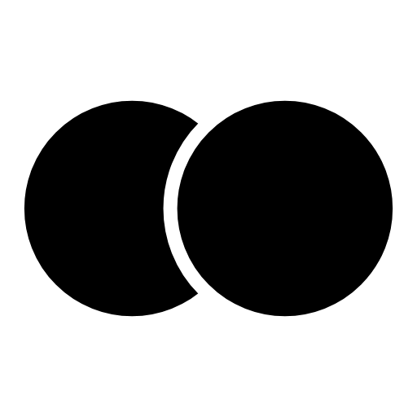

# Doot Agent

**A sophisticated agentic platform for autonomous task execution**

 

## 🎬 Demos

### Desktop Application

https://github.com/user-attachments/assets/223173bf-3cfc-4686-afcc-3d7ae061ebbf

> Doot Agent Desktop - Full-featured desktop application with advanced agentic orchestration

### Local Agent Execution

https://github.com/user-attachments/assets/6b776c79-18d3-4573-8ed4-701b35fa666f

> Running agents locally with real-time interaction and state management

 

## 🚀 About Doot Agent

Doot Agent is an advanced **agentic orchestration platform** built with sophisticated AI agent architecture. It leverages cutting-edge techniques including:

- **🔄 Checkpointing** - Persistent state management for long-running tasks with automatic recovery
- **⚡ Interrupts** - Human-in-the-loop interventions for critical decision points
- **📊 Streaming** - Real-time agent execution and response streaming
- **🧠 Memory Management** - Context-aware scratchpad for adaptive behavior
- **🎯 Dynamic Tool Selection** - Context-driven tool exposure with intelligent reserves
- **🔁 Reflection & Replanning** - Self-correcting agents that escape local minima

Built on **LangGraph** with custom extensions for enhanced chain-of-thought control and multi-SDK integration.

 

## 🤖 Agents

### 1. 🌐 Browser Agent
Advanced web automation agent that combines spatial understanding with DOM parsing for reliable browser interactions. Features include:
- Screenshot-based visual grounding for complex UIs
- Hybrid approach (DOM + spatial) for optimal accuracy
- Dynamic tool registry that adapts to browser state
- Handles dropdowns, forms, navigation, and complex workflows

### 2. 🔧 MCP Builder Agent
Model Context Protocol (MCP) integration agent designed to build and manage MCP servers. Enables seamless connection to external tools and services through standardized protocols.

### 3. 🏢 Multi-Agent Company Automation
Complete enterprise automation solution with specialized agents:
- **Tester Agents** - Automated testing and quality assurance
- **Developer Agents** - Code generation and refactoring
- **Project Management Agents** - Task tracking and coordination
- **Integration Agents** - Cross-system workflow automation

Orchestrates multiple agents working collaboratively to automate end-to-end company workflows.

 

## 📚 Documentation

👉 **See [ARCHITECTURE.md](./architecture.md) for detailed technical documentation**

This repository contains architecture notes, design decisions, and technical implementation details. Learn about:
- Agentic architecture patterns
- Tool registry and reserves system  
- Dynamic prompt injection
- Thought control and SDK integration
- Performance optimizations and benchmarks

 

---

Built with ❤️ using LangGraph and advanced agentic patterns

